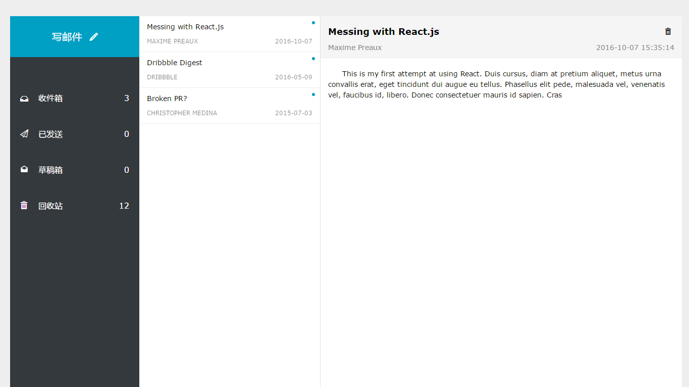

# React 示例项目

  This is a React Inbox demo based on [React Demo]


### Installation

You need cross-env installed globally:

```sh
$ npm i cross-env -g
```

```sh
$ git clone https://github.com/salody/React-Mail-demo.git
$ npm install
$ npm start
```

### Reference
[React Demo]
License
----

MIT


**Free Software, Hell Yeah!**

[//]: # (These are reference links used in the body of this note and get stripped out when the markdown processor does its job. There is no need to format nicely because it shouldn't be seen. Thanks SO - http://stackoverflow.com/questions/4823468/store-comments-in-markdown-syntax)


   [React Demo]:https://github.com/kenberkeley/react-demo
